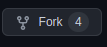
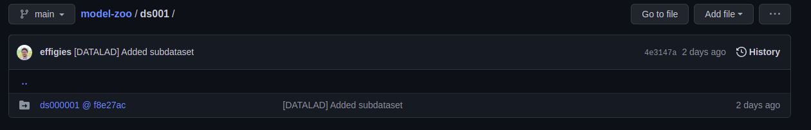
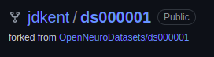

# model-zoo
Zoo of BIDS Stats Models (extraordinarily experimental)


## How to edit datasets (with small files)

### step 1: fork model-zoo to your profile
go to [model-zoo](https://github.com/bids-standard/model-zoo) and press the fork button on github and select the profile/organization you would like to fork to.



### step 2: fork the dataset you need to edit
Find the dataset you need to edit within model-zoo



Click on the hyperlink to go to the github repo


Click on the fork button and select the profile/organization you would like to fork to.



### step 3: clone the forked model-zoo to your local machine

#### template:
```
git clone https://github.com/<username>/model-zoo.git
```

#### example:
```
git clone https://github.com/jdkent/model-zoo.git
```

### step 3b: (optional) change branch in model-zoo

#### template:
`git checkout -b <branch>`

##### example:
`git checkout -b add_new_model`


### step 4: change directories to the dataset you want to edit

#### template:
`cd model-zoo/ds<num>/ds<num>`

#### example:
`cd model-zoo/ds005/ds000005`

### step 5: change the remote dataset to your fork of the dataset

#### template:
```
git remote rename origin upstream
git remote add origin https://github.com/<username>/ds000005.git
```

#### example:
```
git remote rename origin upstream
git remote add origin https://github.com/jdkent/ds000005.git
```

### step 6: change the .gitmodules file to your fork of the dataset

#### example:
open the model-zoo/.gitmodules file in your favorite editor (e.g., vim, vscode, nano)

##### before:
```
[submodule "ds005/ds000005"]
	path = ds005/ds000005
	url = https://github.com/OpenNeuroDatasets/ds000005
	datalad-id = b2c7f086-8704-11e8-9916-0242ac120015
	datalad-url = https://github.com/OpenNeuroDatasets/ds000005
```

##### after:
```
[submodule "ds005/ds000005"]
        path = ds005/ds000005
        url = https://github.com/jdkent/ds000005
        datalad-id = b2c7f086-8704-11e8-9916-0242ac120015
        datalad-url = https://github.com/jdkent/ds000005
```

### step 7: (optional) change the branch for the dataset

#### template:
`git checkout -b <name of branch>`

#### example:
`git checkout -b add_participants_tsv`

### step 8: modify the dataset

#### example:
`touch participants.tsv`


### step 9: commit and push the changes to the dataset repo (assuming only smallish files)


#### template:
```
# while inside the folder ds<number>/ds<number>
git add <file>
git commit -m '<message>'
git push origin <branch>
```

#### example:
```
# while inside the folder ds005/ds000005
git add participants.tsv
git commit -m 'add age information'
git push origin add_participants_tsv
```

### step 10: commit and push changes to your model-zoo repo

#### template:
```
# while inside the folder model-zoo/
git add ds<number>/ds<number>
git commit -m '<message>'
git push origin <branch>
```

#### example:
```
# while inside the folder model-zoo/
git add ds005/ds000005
git commit -m 'update dataset'
git push origin add_new_model
```